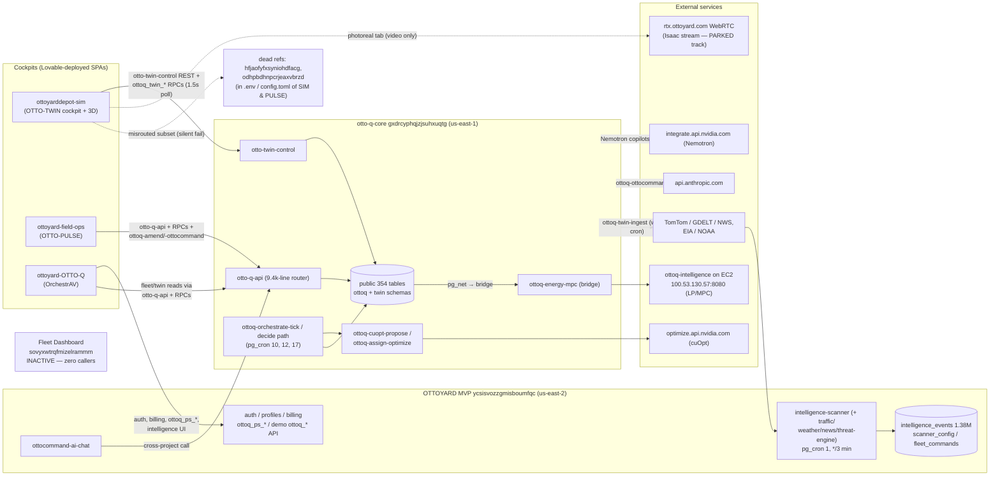

# SYSTEM_TOPOLOGY.md — OTTOYARD System & Repo Topology Audit

**Run 1, Phase C1 deliverable.** Compiled 2026-08-18/19 UTC.
Method: live Supabase Management API (all three projects), live SQL against `otto-q-core` and
`OTTOYARD MVP`, and full read-only scans of all ten OTTOYARD repos (including git history where it
mattered). Every claim below is verified against those sources, not against prior docs. Where a
number has a date, that is the date it was measured.

---

## 1. Executive summary

- **The canonical repo for `CLAUDE.md` (and all Run 1–4 deliverables) is `otto-q-core`** (§10).
- **Three Supabase projects confirmed exactly as CLAUDE.md Part 3 describes them** (§2). The
  INACTIVE Fleet Dashboard has **zero references in any repo's code, env, or config** — it is dead
  wiring and safe to archive (§5).
- **The real misrouting hazard is not the MVP — it is two *dead* project refs**
  (`hfjaofyfxsyniohdfacg`, `odhpbdhnpcrjeaxvbrzd`) that remain live in `.env` files and
  `supabase/config.toml` of the cockpit repos. In `ottoyarddepot-sim` a specific set of features
  actively calls `ottoq_*` objects **through the dead ref** and fails silently (§5.2).
- **Hermes's data footprint is fully pinned** (§6): `intelligence_events` (1,378,654 rows, growing
  ~481/day) is written from *inside* the MVP project itself — pg_cron job 1 every 3 minutes →
  `intelligence-scanner` edge function → per-source scanners gated by `scanner_config`. No external
  process writes it. `fleet_commands` is dormant (1 row, 2026-03-08).
- **AGENTS.md reconciliation done** (§8): the core repo's AGENTS.md had already been partially
  corrected on 2026-08-18 (commit `f6f4f9f`); the residual stale claims (migration range, phantom
  unmerged branch, missing MVP role) are fixed in this commit, and the "one database that
  matters / OrchestrAV's legacy database" mislabel is corrected in the four sibling repos that
  still carry it.
- **The 3D rendering layer lives in `ottoyarddepot-sim`** (§9): an in-house react-three-fiber
  scene (`src/components/canvas/` + `src/engine/TwinMotionDriver.ts`). Isaac Sim is consumed only
  as a WebRTC video stream (photoreal tab); its Python driver is already quarantined — nothing
  imports it.
- **Core's scratch-table population is 120 tables** for the six named prefixes: 57 registered
  `evidence`-class in `ottoq_run_scope_registry` (keep, move to an `evidence` schema), 63
  unregistered (archive/drop candidates). Full lists in Appendix A.
- Notable incidental findings for later runs are collected in §11 — including one build-breaking
  defect on `ottoyard-field-ops` `main` and a contradiction between CLAUDE.md's description of the
  cuOpt deferral pattern and migration `0032`, which removed it.

---

## 2. The three Supabase projects (verified live, Management API)

| Project | Ref | Region | Status | Postgres | Created | Role |
|---|---|---|---|---|---|---|
| otto-q-core | `gxdrcyphqjzjsuhxuqtg` | us-east-1 | ACTIVE_HEALTHY | 17.6 | 2026-04-04 | **The engine.** 354 tables + 46 views in `public`, plus `ottoq` (48 fns) and `twin` (71 fns) schemas. Rules, twin, cuOpt pipeline, energy, OCPP, audit. |
| OTTOYARD MVP | `ycsisvozzgmisboumfqc` | us-east-2 | ACTIVE_HEALTHY | 17.4 | 2025-07-25 | Original demo backend; OrchestrAV **auth + billing + retail (`ottoq_ps_*`)**; the demo `ottoq_*` API set; **Hermes's live intelligence pipeline** (§6). Active, not legacy — but never the engine. |
| OTTOYARD Fleet Dashboard | `sovyxwtrqfmizelrammm` | us-east-2 | **INACTIVE** | 17.4 | 2025-08-16 | Dead wiring. Zero live callers (§5.1). |

Two further refs appear in repo configs but correspond to **no project in the org**:
`hfjaofyfxsyniohdfacg` and `odhpbdhnpcrjeaxvbrzd` (§5.2).

**Core runtime surface (live 2026-08-18):** 26 ACTIVE edge functions; pg_cron jobs — 2
`ottoq-twin-ingest-weekly` (weekly), 10 `ottoq-depot-tick` (*/2 min), 11 `ottoq-retention-nightly`
(daily), 12 `ottoq-demo-metronome` (every minute — the run engine, never disable), 13
`ottoq-cert-battery` (inactive), **17 `ottoq-run-governor` (*/2 min — new since the 2026-08-03
snapshot; not yet described in any repo doc)**.

**MVP runtime surface:** 36 ACTIVE edge functions (demo `ottoq-*` API set, AI/OttoCommand set,
Stripe/billing set, reporting set, and the five `intelligence-*` scanners); pg_cron job 1
`intelligence-scanner-job` (*/3 min).

---

## 3. Repo inventory

| # | Repo | What it is | Runtime backend | Deploy | CI | Verdict |
|---|---|---|---|---|---|---|
| 1 | `otto-q-core` | **The brain, in files**: `db/baseline/` (455 routines, 283 tables, 2026-08-03/04), `db/migrations/` 0001–0042, 27 edge-function sources, CLAUDE.md/HERMES.md/AGENTS.md, drift checker | gxdrc (only) | manual (MCP/CLI/psql per `scripts/APPLYING.md`) | none | **CANONICAL** |
| 2 | `otto-q-core-snapshot` | Byte-exact export of gxdrc as of 2026-08-03 (prev. 2026-07-13); 621-entry migration ledger, cron, RLS state | n/a (snapshot) | n/a | none | Keep as dated evidence; **superseded as canonical by #1** |
| 3 | `ottoyarddepot-sim` | **OTTO-TWIN cockpit + the 3D rendering layer** (§9); Vite/React/r3f; also `isaac/`, `unreal/`, charge-arm pages | gxdrc **hardcoded** (primary path); dead `hfjao…` via `.env` for a feature subset (§5.2) | Lovable (two-way sync on `main`) | `verify.yml` (typecheck+test+build) — the only repo with CI | LIVE |
| 4 | `ottoyard-OTTO-Q` | **OrchestrAV** — fleet-owner cockpit (public repo). Split brain: auth/billing/intelligence/`ottoq_ps_*` on MVP; fleet/twin reads on gxdrc via `otto-q-api`. Also hosts the *source* of all 36 MVP edge functions incl. the intelligence scanners | MVP (`ycsis…`) + gxdrc, split by feature | Lovable | Claude-action workflow only (no build/test gate) | LIVE |
| 5 | `ottoyard-field-ops` | **OTTO-PULSE** — depot-operations cockpit | gxdrc **hardcoded**; `.env`/`config.toml` point at dead `odhpb…` (dead code, 0 importers) | Lovable | none | LIVE — but `main` currently fails to build (§11.1) |
| 6 | `ottoq-intelligence` | **AWS energy-MPC microservice** (public repo): FastAPI + PuLP/HiGHS LP on EC2 (`100.53.130.57:8080`); stateless, **no DB client at all**; reached only via the `ottoq-energy-mpc` edge-function bridge. NOT the Hermes scanner | none (request-driven) | EC2 docker (`deploy/DEPLOY_EC2.md`) | none | LIVE |
| 7 | `otto-q-workspace` | Planning/docs workspace (80 md: Lovable prompts, certs/receipts, architecture plans) + historical code (robovac bridge, USD assets, scripts). `RESUME_HERE.md` (2026-08-13) is its only doc reconciled against the live DB | n/a (docs; scripts target gxdrc) | n/a | none | Reference archive; most docs pre-August and historical |
| 8 | `ottoyard-agent-context` | **Shared agent brain** (private): operating contract, HERMES_BOOTSTRAP/FLEET_PROMPTS, docs/00–18, 81 verbatim memory files (2026-07-21 → 08-08) | n/a | n/a | none | LIVE (governance) |
| 9 | `OTTOYARD` | GitHub profile README | none | n/a | none | Trivial |
| 10 | `Otto-charge-arm` | Single-file static HTML charge-arm visual demo (4,612 lines, zero backend refs) | none | static | none | Trivial |

---

## 4. Call graph



Notes:
- **Edge functions per project and their invokers:** core's 26 functions are invoked by the three
  cockpits (`otto-q-api`, `otto-twin-control`, `ottoq-amend`, `ottoq-cleaning-cadence`,
  `ottoq-ottocommand`, `ottoq-fleet-vehicles`, `ottoq-jobs-request`, `ottoq-depot-resources`), by
  pg_cron-driven DB functions via hardcoded `.../functions/v1/...` URLs inside function bodies
  (`ottoq-cuopt-propose`, `ottoq-energy-mpc`, `ottoq-orchestrator-agent`, `ottoq-twin-ingest`),
  and by the UE/Isaac bridge scripts (`otto-twin-control`). MVP's 36 functions are invoked by
  OrchestrAV and by MVP's own pg_cron (the scanner). The MVP function `ottocommand-ai-chat`
  calls **core** functions cross-project (`function-executor.ts`).
- **The site is never without a poller:** no cockpit uses Supabase realtime; everything is HTTP
  polling (2 s twin bridge in PULSE, 1.5 s snapshot in SIM, ~10 s RPC polls elsewhere).

---

## 5. Live vs. dead

### 5.1 Fleet Dashboard (`sovyxwtrqfmizelrammm`) — confirmed dead

- Management API: INACTIVE (paused) since ~Aug 2025.
- Grep across **all ten repos** (code, `.env`, configs, docs, git history): the ref appears only in
  prose in `otto-q-core` (CLAUDE.md/AGENTS.md), `ottoyard-agent-context` (system map: "candidate to
  archive"), and one otto-q-workspace architecture doc. **Zero code/config references.**
- **Disposition: no live callers exist. Safe to archive/delete the project.**

### 5.2 The dead refs are the active hazard

| Repo | Where | Effect |
|---|---|---|
| `ottoyarddepot-sim` | `.env` (committed) + `supabase/config.toml` → `hfjaofyfxsyniohdfacg` | **Real, live misrouting.** The `.env`-driven client carries: `historyStore`/`runPersistence` (`simulation_runs` CRUD — works, that table exists on the dead-ref project), but also `TwinCopilotTab` → `ottoq-nemotron-copilot`, `TwinScorekeeperTab` → `ottoq-benchmark-run`, `TwinSwapTestTab` → `ottoq_swap_test_scoreboard`, `TwinRecallTab` → `ottoq_hw_*` RPCs, `aiAnalysis`/`twinAnalysis` → `analyze-simulation`, `nvidia-cuopt` → `cuopt-optimize`. The `ottoq_*` objects live on **gxdrc**, so these tabs fail silently against the wrong project — exactly the failure mode CLAUDE.md Part 3 predicts. |
| `ottoyard-field-ops` | `.env` (committed) + `supabase/config.toml` → `odhpbdhnpcrjeaxvbrzd` | Latent only: the `.env`-driven client has **zero importers**; all runtime traffic uses the hardcoded gxdrc client. But the config.toml misdirects any Supabase CLI use. |
| `ottoyard-OTTO-Q` | `supabase/config.toml` → `ycsis…` | Correct *for this repo's own `supabase/` dir* (its migrations/functions genuinely describe MVP), but reinforces the trap that the fleet-data half of the app (gxdrc) has no source here. |

### 5.3 Pointed at MVP — deliberate vs. drift

- **Deliberate (documented design, keep for now):** OrchestrAV auth/billing/`ottoq_ps_*` on MVP;
  the intelligence stack on MVP (Hermes's own footprint). Standing doctrine: "auth on ycsis, data
  on gxdrc — do not entangle them further."
- **Drift candidates (should eventually point at core):** OrchestrAV's reads of MVP's demo
  `ottoq_cities` / `ottoq_simulator_state` and the demo `ottoq-*` edge-function API set — these
  duplicate core concepts under colliding names.
- **Duplicate-name hazard confirmed by schema:** `ottoq_events` exists in both projects with
  different meaning — MVP: 72 rows, generic `(entity_type, entity_id, event_type, payload_jsonb)`
  demo log; core: the 20.8k-row HMAC-signed telemetry event stream. A client at the wrong ref
  fails silently. Same-name collisions also exist for `ottoq_cities`, `ottoq_depots`,
  `ottoq_vehicles`, `ottoq_jobs`, `ottoq_schedules`, `ottoq_simulator_state` (MVP demo schema) vs.
  core's engine tables.

---

## 6. Hermes's data footprint (MVP project) — verified live

| Object | Facts (measured 2026-08-18) |
|---|---|
| `intelligence_events` | 1,378,654 rows; first 2026-03-08 16:00Z, last write minutes before measurement; 481 rows in the last 24 h. By source: `tomtom_traffic` 1,343,700 · `gdelt_news` 34,436 · `nws_weather` 518. |
| `scanner_config` | Single row of per-source toggles/intervals: weather 5 min, traffic 3 min, news 10 min, emergency **disabled**; cities Nashville, Austin, LA, San Francisco; per-source `*_last_scan_at` fresh to the minute. |
| `fleet_commands` | 1 row total (2026-03-08 16:32Z). Dormant. |

**Writer and cadence:** MVP pg_cron job 1 `intelligence-scanner-job` (`*/3 * * * *`) →
`net.http_post` → MVP edge function `intelligence-scanner`, which fans out to
`intelligence-traffic` / `-weather` / `-news` / `-threat-engine` according to `scanner_config`
intervals. **All writes originate inside the MVP project.** The pipeline's *source code* lives in
`ottoyard-OTTO-Q/supabase/functions/intelligence-*` and its schema + cron in that repo's
migrations (`20260308155804`, `20260308160336`). The `ottoq-intelligence` repo, despite its name,
has nothing to do with this pipeline (it is the AWS energy-MPC service and has no DB client).
"Hermes's pipeline" therefore means: Hermes built and owns it; no external Hermes process holds a
write path today.

---

## 7. Hermes agent files across repos — inventory and drift

| File | Repo | What it instructs |
|---|---|---|
| `HERMES.md` (2026-08-18, newest) | otto-q-core | Research track master brief: research only, never production code; deliver via PRs into `docs/research/**` (H-files, `answers/R-*`); poll `docs/research/requests/` at session start; DB use **read-only** (SELECT), sole exception the pre-existing `intelligence_events` ingestion; no Issues API (token lacks scope); Telegram notification-only. |
| `HERMES_BOOTSTRAP.md` (~2026-08-08) | ottoyard-agent-context | Persistent-instruction payload: clone-fresh workflow, `hermes/<slug>` branches, PR-only, autonomy list that **includes authoring migrations** (preview-branch tested); approval list; cron-12 protection. |
| `HERMES_FLEET_PROMPTS.md` (~2026-08-08) | ottoyard-agent-context | Six-agent fleet (Conductor + Lanes A–D + Reviewer); **GitHub-issue-based polling** in the private context repo; Conductor is the only Telegram speaker; Lane C is the production migration applier. |
| `docs/18_FLEET_COORDINATION.md` | ottoyard-agent-context | Declared BINDING LAW over the other two when in fleet mode. |
| `AGENTS.md` (each repo) | all product repos | Only the `hermes/<slug>` branch-naming convention plus shared org rules. |

**Drift flags (HERMES.md is newest and narrowest — treat it as governing):**
1. **Scope conflict:** HERMES_BOOTSTRAP/FLEET_PROMPTS grant Hermes migration-authoring and a
   production-applier lane; HERMES.md (2026-08-18) restricts Hermes to research and
   `docs/research/**` only. Git history shows Hermes **has** authored and merged engine migrations
   (0028 among them, plus 12 of the last 20 core-repo merges) — consistent with the older
   contract, predating HERMES.md.
2. **Coordination-channel conflict:** FLEET_PROMPTS assumes issue-based coordination; HERMES.md
   and CLAUDE.md record the token has **no `issues` scope (403)** and mandate the
   `docs/research/requests/` file-polling loop instead.
3. **Not yet bootstrapped:** `docs/research/` (requests/answers/H-files) does not exist in
   otto-q-core yet; it is created by the first request or Hermes PR.

---

## 8. AGENTS.md reconciliation (C1 item 6) — done in this commit set

**History:** the mislabel CLAUDE.md Part 3 quotes ("the one database that matters …
OrchestrAV's legacy database (`ycsis…`)") existed verbatim in otto-q-core's AGENTS.md until
2026-08-18, when commit `f6f4f9f` (Hermes) replaced the passage with a mostly-correct three-project
description. Residual drift found and fixed now:

| Repo | What was wrong at HEAD | Fix |
|---|---|---|
| `otto-q-core` | "Migrations run 0001–0022" (repo holds 0001–0042, no 0024); "`0022` … still on branch `p0022-run-scope-integrity` — the only unmerged branch in any OTTOYARD repo" (no such branch exists on origin); `ycsis…` described only as a misrouting hazard, omitting its live role | Corrected in `AGENTS.md` (this commit) |
| `ottoyarddepot-sim` | "The one database that matters…" + "OrchestrAV's legacy database (`ycsis…`)" | Passage replaced with the verified three-project description |
| `ottoyard-field-ops` | same | same |
| `ottoyard-OTTO-Q` | same | same |
| `ottoq-intelligence` | same | same |

Also noted (not edited — founder documents): `CLAUDE.md:176`'s hazard sentence and `HERMES.md:44`'s
"AGENTS.md … mislabels the projects" now describe a pre-`f6f4f9f` state of the core repo's
AGENTS.md; the sibling-repo copies were the surviving instances and are fixed by this commit set.

Known remaining doc/state gaps recorded for Run 2+ (not C1 scope to fix):
`MIGRATION_LOG.md` has 1 row against 41 migration files; migrations 0026–0033 and 0035–0042 lack
`migration-version:` headers, making them invisible to `check-drift.sql`'s generated manifest.

---

## 9. Where the 3D rendering layer lives

**In-house renderer (the product): `ottoyarddepot-sim`.**
- Scene: `src/components/canvas/DepotScene3D.tsx` + 20 modules in `src/components/canvas/three/`
  (ground, building, canopies, charging field + articulated charge arm, wash/service bays, lanes,
  weather, day/night lighting, post-processing). 2D fallback `DepotSVG.tsx`.
- Motion: `src/engine/TwinMotionDriver.ts` (~2,500 lines) + `src/engine/motion/`
  (LaneGraph/RailFlow/IDM). Discrete truth is server-side; the client interpolates itinerary legs
  from `ottoq_twin_snapshot` — the exact "playback timeline" seam CLAUDE.md §2.8 names.
- Data: polls core's `otto-twin-control` edge function (layout, snapshot, run control) and the
  `ottoq_twin_*` RPC family. No realtime channels.

**Isaac/Omniverse ("Track B", PARKED) — current state is already near-quarantined:**
- `isaac/otto_motion.py`: Python driver for Isaac Sim; imported by nothing in the app.
- `unreal/`: UE5/USD builders + generated layout seeds; Python never imported; the JSON seeds are
  read only by Node test/build scripts. Truth flows one-way from `src/lib/sitePlan.ts`.
- `src/components/photoreal/OmniverseViewer.tsx`: lazy-loaded WebRTC viewer
  (`rtx.ottoyard.com:443` / `54.166.168.193:47998`) — consumes Isaac as **video**, not code.
  Blank when the AWS box is off; the app is unaffected.
- C2 handles the `PARKED_ISAAC` tagging decision (quarantine vs. recommendation).

---

## 10. Canonical repo declaration

**`otto-q-core` is canonical** for CLAUDE.md and for all Run 1–4 deliverables. Evidence:
1. It holds the operating trio (CLAUDE.md build brief, HERMES.md research brief, AGENTS.md
   contract) merged via PR #42 on 2026-08-18 — the newest governance in the org.
2. It holds the complete brain-in-files: `db/baseline/` (455 routines / 283 tables), the
   0001–0042 migration series with checks and evidence, and all 27 core edge-function sources.
3. `otto-q-core-snapshot` — once called "the canonical OTTO-Q backend repo" in an agent-context
   memory (2026-08-0x) — is a dated read-only export (2026-08-03), 15+ days behind the live DB and
   without the migration series. It remains valuable as point-in-time evidence; it is not the
   working repo.
4. HERMES.md's delivery target (`docs/research/**`) and CLAUDE.md's own resume rules both assume
   this repo.

---

## 11. Incidental findings (for the record; owners in later runs)

1. **`ottoyard-field-ops` `main` cannot build:** `src/hooks/useTwinData.ts:118` contains a stray
   `n` before `.from('ottoq_sim_runs')` (botched `\n` escape, introduced by PR #12
   `hermes/wire-pulse-hooks`). Syntax error → `lint`/`test`/`build` all fail; the AGENTS.md verify
   gate cannot have been run for that PR.
2. **cuOpt deferral pattern removed vs. doctrine:** migration `0032_cuopt_batch_enactment.sql`
   removed the deferral mechanism (`ottoq_cuopt_defer_*`) in favor of atomic batch enactment,
   while CLAUDE.md §2.5/Part 3 and HERMES.md still describe deferral/right-of-first-refusal as the
   live architecture. C4 must quantify from the ledger and re-describe the as-is pipeline.
3. **`ottoq_fn_backup_*` exists only in the live DB** (13 tables: cold_start, dcfc_day_night,
   dcfc_first, demate_deadlock, frozen_target, geometry_contract, night_waves,
   plug_target_policy, single_run, soc_clamp, stall_watchdog, supersede_churn,
   tick_observability — plus `ottoq_fn_definition_backups` and layout/rule backups). None of it is
   in any repo file, including `db/baseline/` (captured before their creation). Per the repo's own
   rule ("if it isn't a committed file, it didn't happen"), C4 should capture these when it
   documents the decide path.
4. **Committed anon keys / non-gitignored `.env`** in `ottoyarddepot-sim`, `ottoyard-field-ops`,
   `ottoyard-OTTO-Q` (anon-role only, but `ottoyard-OTTO-Q` and `ottoq-intelligence` are public
   repos); hardcoded bridge token `ottoq-frontier-…` + plain-HTTP EC2 URL in
   `ottoq_energy_mpc_replan` defaults and the edge bridge — already a known open item
   (FR1/AGENTS.md), restated here because both repos are public.
5. **New cron job 17 `ottoq-run-governor`** (added after 2026-08-03) is undocumented in every
   repo; `db/baseline/cron_jobs.sql` lists only 5 jobs.
6. **`ottoyard-OTTO-Q` "`Create src/`" directory** (three files with trailing-colon names) is an
   agent artifact, unbuildable and unreferenced — safe to delete in any later cleanup.
7. **Migration `0042` deletes `ottoq_events` rows** (NULL `sim_run_id`, 117k+) against the house
   rule "never touch `ottoq_events`" in `db/migrations/README.md` — worth an explicit doctrine
   ruling before C7 formalizes the event vocabulary.

---

## Appendix A — Core scratch-table classification (C1 item 7)

Population (live, prefixes `proof|cert|smoke|fwd|mig|build` in `public`): **120 tables**, total
size well under 10 MB (largest single table ~630 kB). The run-scope registry
(`ottoq_run_scope_registry`, 219 classified columns: 172 evidence / 44 engine / 2 run_ledger /
1 stamp) is the classifier of record.

Additional scratch-shaped families exist beyond the six prefixes (`p<N>_*`, `phase<N>_*`,
`cuopt_*_proof_*`, dated `*_2026_08_*` captures) — recommended for the same treatment in a
follow-up sweep once the named-prefix set is settled.

### A.1 KEEP — registered `evidence`-class (57 tables)

These are cited by certification write-ups and the registry; they are the run-ID-backed proof
substrate. **Recommendation: move to a new `evidence` schema** (rename-free `ALTER TABLE … SET
SCHEMA`), so `public` stops being a lab bench while every proof stays queryable. Update the
run-scope registry's `table_schema` rows in the same migration.

```
build2_bookings_raw_2026_08_02   build2_cert_424242               build2_interrupted_recount_2026_08_02
build2_visit_needs_raw_2026_08_02 build3_pre_bookings_2026_08_02  build3_pre_legs_2026_08_02
build3_smoke_bookings_2026_08_02 build3_smoke_legs_2026_08_02     cert0020_runa_snapshot
cert0022_a_after_b               cert0022_a_bookings              cert0022_a_dispatches
cert0022_a_flags                 cert0022_a_runrow                cert0022_a_visitneeds
cert0022_b_bookings              cert0022_b_dispatches            cert0022_b_flags
cert0022_b_runrow                cert0022_b_visitneeds            cert0023_a_bookings
cert0023_a_dispatches            cert0023_a_energy                cert0023_a_flags
cert0023_a_running               cert0023_a_runrow                cert0023_a_stalls*
cert0023_a_visitneeds            cert0023_b_bookings              cert0023_b_dispatches
cert0023_b_energy                cert0023_b_flags                 cert0023_b_runrow
cert0023_b_visitneeds            cert0023_c_needs_before          cert0023_c_needs_terminal
cert0023_stop_pre                fwd2_pre909_card                 fwd2_pre909_runrow
fwd2_urgency_samples             fwd3_postboot_wear               fwd3_postrun_bookings
fwd3_postrun_legs                fwd3_postrun_wear                fwd3_prerun_wear
mig0003_smoke_receipt_bookings   mig0003_smoke_receipt_decisions  mig0006_runrows
mig0006_smoke                    mig0009_pre_dispatches           mig0009_pre_visit_needs
mig0009_run920_dispatches        proof0008_wear_prestate          proof0012_binding_blocker
proof0012_prearrival_census      smoke890_bookings_2026_08_03
```
(*`cert0023_a_stalls` appears in the live registry list; its `cert0022`/`cert0023` `_stalls`
siblings that are unregistered appear below — register or archive them consistently with their
cert batch.)

### A.2 ARCHIVE/DROP candidates — unregistered (63 tables)

Not present in the run-scope registry; mostly prestate captures, probes, and smoke intermediates
whose conclusions are already recorded in `db/evidence/*.md` or MIGRATION headers.
**Recommendation:** one review pass against the P00xx evidence docs; anything cited there gets
registered as `evidence` and moved with A.1; the rest are dumped to cold storage (CSV in repo
under `db/evidence/archive/` if wanted) and dropped. Nothing here blocks engine operation — none
carry `sim_run_id` purge exposure in the active tick path.

```
build1_smoke_result              build2_needscard_before_2026_08_02  cert0022_a_stalls
cert0022_b_stalls                cert0022_collision                  cert0022_fk_orphan_sweep
cert0022_misc                    cert0022_orphan_refusal             cert0022_orphans_by_class
cert0022_purge_receipt           cert0023_b_stalls                   cert0023_coldiff
cert0023_energy_probe            cert0023_fk_orphan_sweep            cert0023_misc
cert0023_trigger_paths           fwd1_cert_424242                    fwd2_atom_samples
fwd2_boot_profiles               fwd2_card_samples                   fwd2_pre909_profiles
fwd2_profile_samples             fwd2_soil_laundering_evidence       fwd3_bay_exits
fwd3_gate_probe                  fwd3_pgss_t0                        fwd3_postboot_profile
fwd3_postrun_atoms               fwd3_postrun_bay_exits              fwd3_postrun_profile
fwd3_postrun_stats               fwd3_prerun_cron                    fwd3_prerun_profile
fwd3_prerun_retention_state      fwd3_prerun_stats                   fwd3_tick_probe
fwd4_pre_counts                  mig0003_decoded                     mig0003_smoke
mig0004_smoke_receipt            mig0006_cron_prestate               mig0006_drift_out
mig0006_drift_src                mig0006_source                      mig0009_immutability_test
mig0009_prerun_protect           mig0009_run920_exits                mig0020_policy_prestate
mig0020_prestate                 proof0008_cron_prestate             proof0008_profile_prestate
proof0008_soil_smoke             proof0009_credit                    proof0009_eta
proof0012_428c9                  proof0012_cron_before               proof0012_fk
proof0012_fk_all                 proof0012_ticks_before              proof0012_window
smoke0005_profile_prestate       smoke0005_visit_needs_prestate
```

### A.3 Related backup families (not scratch — keep, different discipline)

`ottoq_fn_backup_*` (13 policy-named function-definition backups), `ottoq_fn_definition_backups`,
`ottoq_layout_backup_0010_*`/`0011_*`, `ottoq_grant_boundary_backup`,
`ottoq_stall_distance_backup_20260812`, `rule_overrides_backup_20260805`. These are recovery
substrate, not experiment residue: keep, and have C4 export the `ottoq_fn_backup_*` contents into
the repo (finding §11.3).
